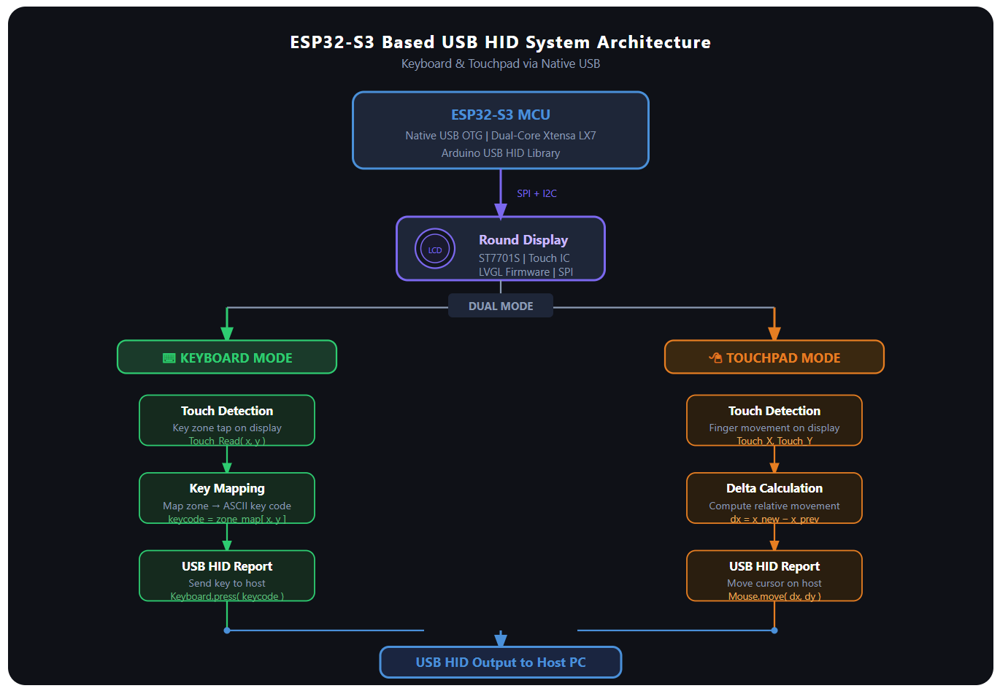

# ESP32-S3 USB HID Interface — Keyboard & Touchpad System

## Overview
ESP32-S3 based USB HID device that functions as both a keyboard 
and mouse using a round touchscreen display. No host-side drivers 
required — uses the ESP32-S3's native USB HID emulation.

Developed during internship at i-WORKZ Automotive Pvt. Ltd., 
Bengaluru (Feb–Mar 2026).

## System Architecture

## Features
- Dual-mode interface: on-screen keyboard + touchpad mouse control
- LVGL-based boot UI with touch-selectable keyboard and mouse modes
- Touch input mapped to USB HID keycodes for keyboard mode
- Relative mouse movement via touch delta calculation (dx, dy)
- Native USB HID — no additional host drivers needed

## Hardware Used
- ESP32-S3 development board
- Round display (ST7701S driver + capacitive touch IC)
- USB cable to host PC

## Software & Libraries
- Arduino IDE
- LVGL (UI framework for display and touch interface)
- Arduino USB HID Library (Keyboard, Mouse classes)

## How It Works
On boot, the display shows the ESP32 USB Toolbox screen with two 
options — Mouse and Keyboard.

**Keyboard mode:** Tapping keys on the on-screen LVGL keyboard 
maps touch coordinates to ASCII keycodes and sends them to the 
host via USB HID (Keyboard.press()).

**Mouse/Touchpad mode:** Finger movement on the touchpad interface 
calculates relative displacement (dx, dy) and drives cursor 
movement on the host (Mouse.move(dx, dy)). Tap zones handle 
left click, right click, and scroll.

## Demo
*Photos and video coming soon*
