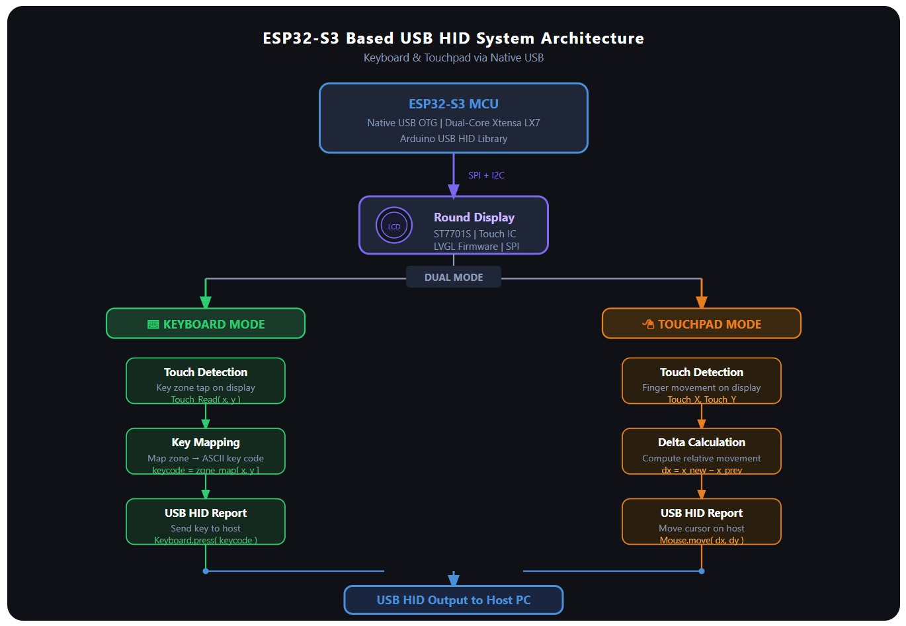
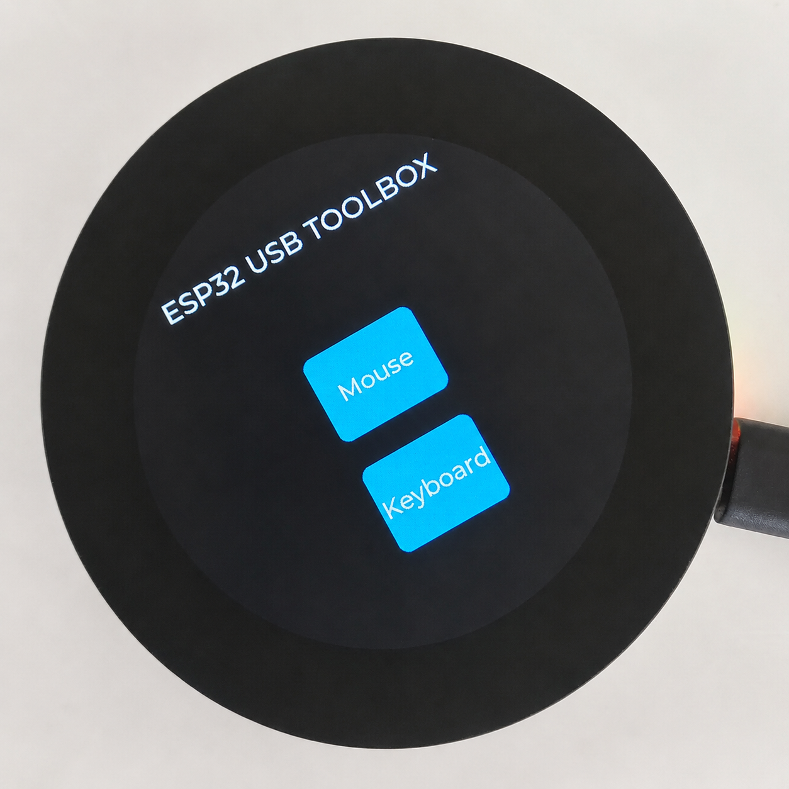
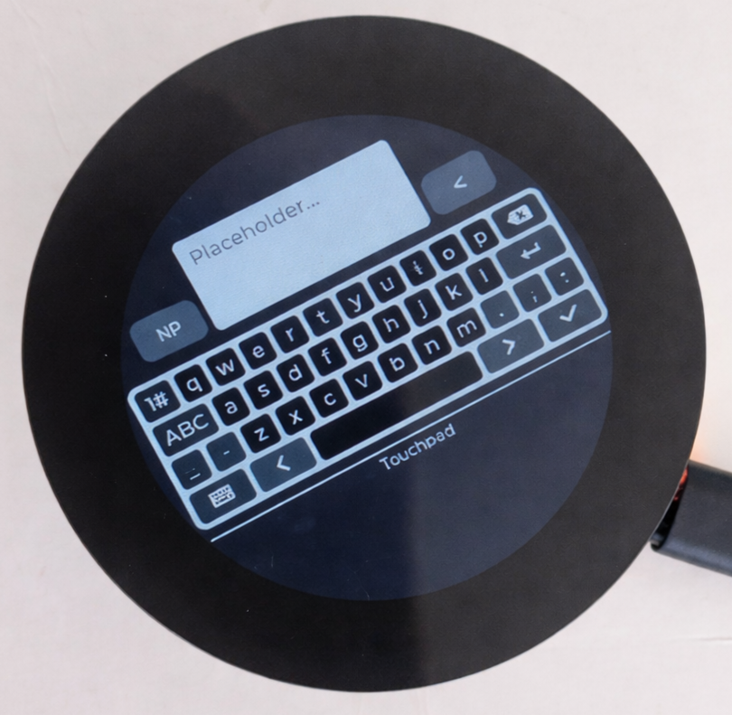
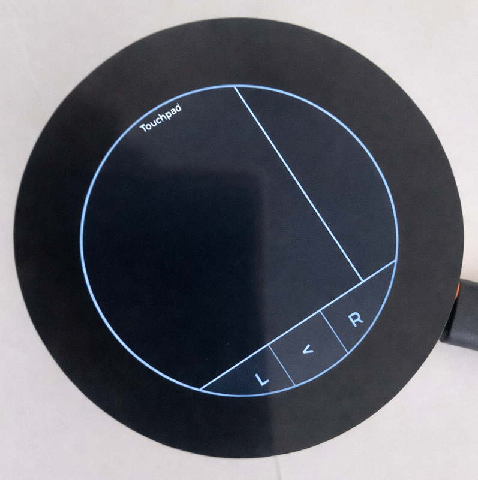

# ESP32-S3 Native USB HID Device — Keyboard & Mouse

An ESP32-S3 based USB Human Interface Device (HID) that emulates a keyboard and a mouse using a round touchscreen display — no host-side drivers required, powered entirely by the ESP32-S3's Native USB OTG support.

## Overview

Most microcontrollers talk to a host PC over serial and need an external USB-to-serial converter or custom driver on the other end. The ESP32-S3 is different — it has Native USB OTG built in, so it can enumerate directly as a standard USB HID device. This project uses that capability to turn the ESP32-S3 into a touchscreen-driven virtual keyboard and virtual mouse that any Windows, Linux, or macOS machine recognizes out of the box as plug-and-play peripherals.

The system boots to a welcome screen with two modes:
- **Keyboard** — full on-screen LVGL keyboard; taps are converted to USB HID keyboard reports
- **Mouse** — touchpad-style interface with left click, right click, and scroll; finger movement is converted to USB HID mouse reports

Developed during an engineering internship at i-WORKZ Automotive Pvt. Ltd., Bengaluru (Feb–Mar 2026).

## System Architecture

## Interface Screenshots

  
  
  

## Features

- Native USB HID — enumerates directly as a USB keyboard/mouse, no host drivers needed
- Dual-mode interface: on-screen keyboard + touchpad-style mouse, selectable from a boot menu
- LVGL-based graphical keyboard with per-key touch callbacks mapped to HID keycodes
- Relative mouse movement via touch-delta (dx, dy) calculation
- On-screen left click, right click, and scroll controls
- Fully plug-and-play — recognized natively by Windows, Linux, and macOS

## Hardware

| Component | Details |
|---|---|
| Microcontroller | ESP32-S3 (Native USB OTG) |
| Display | Round capacitive touchscreen (ST7701S driver + capacitive touch IC) |
| Host Connection | USB cable to host PC |

## Software & Libraries

- Arduino IDE
- LVGL — graphical interface for the keyboard and touchpad UI
- TinyUSB HID — Native USB HID report generation for keyboard and mouse

## How It Works

1. On boot, the ESP32-S3 initializes the display, capacitive touch controller, LVGL engine, and the Native USB stack.
2. The Welcome Screen presents two modes: **Keyboard** and **Mouse**, selected by touch.
3. **Keyboard mode:** Each on-screen key is an LVGL button. A touch event fires a callback that maps the key to a USB HID keyboard report, sent to the host over Native USB — the character appears instantly in whatever app has focus, exactly like a physical keyboard.
4. **Mouse mode:** The screen switches to a touchpad-style layout. Finger movement across the touchpad area is measured as coordinate deltas (dx, dy) and converted into USB HID mouse movement reports, moving the host cursor accordingly. Separate on-screen buttons generate HID reports for left click, right click, and scroll.

This project focuses on Native USB HID keyboard/mouse emulation over a touchscreen interface — it does not implement Bluetooth HID, wireless communication, gesture recognition, macro recording, programmable shortcuts, multimedia keys, gaming-controller functionality, USB host mode, or custom OS-specific drivers.

## Tech Stack

`ESP32-S3` `Embedded C++` `LVGL` `TinyUSB HID` `Native USB OTG` `USB HID Protocol` `Arduino Framework`

## Results

- Reliable USB enumeration as a standard HID keyboard/mouse across multiple host machines
- Verified keyboard character transmission and mouse cursor movement, click, and scroll behavior
- Responsive touch-to-HID-report latency suitable for real-time interaction

## Built During

Engineering Internship — i-WORKZ Automotive Pvt. Ltd., Bengaluru (Feb–Mar 2026)
